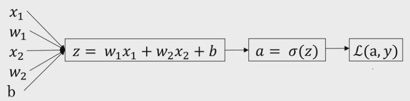

## Logistic Regression Explained
----------------
Binary Classification problem, where the output is either 0 or 1

Denoted by following equation

<!-- $\hat{y} = \sigma(w^Tx + b)$ --> 
----------------
where 

Input

> <!-- $x$ --> 

Sigmoid function    

> <!-- $\sigma(z) = \dfrac{1}{1+e^{-z}}$ --> 

Prediction  

> <!-- $\hat{y}$ --> 

Weights and bias

> <!-- $w$ -->  , <!-- $b$ -->  

---------------

Loss (error) function

<!-- $L(\hat{y}, y) = - (y \log(\hat{y}) + (1-y) \log(1 - \hat{y}))$ --> 
---------------
Cost function

<!-- $J(w, b) = \dfrac{1}{m} \sum_{i=1}^{m} L(\hat{y}^i, y^i) $ --> 
---------------
Gradient Descent

> Repeat 
>    
> <!-- $w = w - \alpha \dfrac{d J(w)}{dw} $ --> 
where learning rate is alpha

### Sigmoid Derivative

The output from sigmoid function is always from 0 to 1. As the value of input(z) increases the output value is closer to 1 and vice versa.
Lets find the derivative for this 

<!-- $
\begin{equation}
\begin{split}
\sigma(z) & = \dfrac{1}{1+e^{-z}} \\
\sigma'(z) & = d\left(\dfrac{1}{1+e^{-z}}\right)\\
where \\
d & = \dfrac{d}{dz}\\
Applying - Reciprocal\\
& = -(1+e^{-z})^{-2}.d\left(1+e^{-z}\right)\\
Applying - Linearity\\
& = -(1+e^{-z})^{-2}.\left(d(1)+d(e^{-z})\right)\\
Applying - Exponential\\
& = -(1+e^{-z})^{-2}.\left(0+e^{-z}d(-z)\right)\\
Applying - Linearity\\
& = -(1+e^{-z})^{-2}.\left(0+(e^{-z}.-1)\right)\\
& = (1+e^{-z})^{-2}.\left(e^{-z}\right)\\
Simplifying\\
& = \dfrac{1}{1+e^{-z}}.\left(1 - \dfrac{1}{1+e^{-z}}\right)\\
& = \sigma(z).(1 - \sigma(z))\\
\end{split}
\end{equation}
$ --> 

> Reciprocal [rule](https://www.youtube.com/watch?v=jFJ1kgzDuWY)

> Exponential [rule](https://www.khanacademy.org/math/ap-calculus-ab/ab-differentiation-2-new/ab-3-1b/v/exponential-functions-differentiation)

> Linearity [rule](https://en.wikipedia.org/wiki/Linearity_of_differentiation)

### Logistic Regression Derivative

<!-- $
\begin{split}
Step - 1:
\dfrac{dL}{da}\\
\\
L(a, y) & = - (y \log(a) + (1-y) \log(1 - a)) \\
Applying - Linearity\\
dL(a, y) & = - (y . \dfrac{1}{a} + (1-y) . \dfrac{1}{1-a} . -1) \\
\\
dL(a, y) & = \dfrac{a-y}{a(1-a)} \\
\end{split}
$ --> 

--------

<!-- $
\begin{split}
Step - 2:
\dfrac{da}{dz}\\
\\
Applying - Sigmoid\\
\dfrac{da}{dz} & = \sigma(z).(1 - \sigma(z)) \\
\dfrac{da}{dz} & = a.(1 - a) \\
\\
\end{split}
$ --> 

---------

<!-- $
\begin{split}
Step - 3:
\dfrac{dL}{dz}\\
\\
Applying - Chain -Rule\\
\dfrac{dL}{dz} & = \dfrac{dL}{da}. \dfrac{da}{dz} \\
\dfrac{dL}{dz} & = \dfrac{a-y}{a(1-a)} . a.(1 - a) \\
& = a-y
\\
\end{split}
$ --> 

----------

### Implementing over m examples

<!-- $
\begin{split}
J =0, dw_1=0, dw_2=0, ..., db = 0\\
for: i=1 -> m\\
z^{i}&=w^Tx^{i} + b \\
a^{i}&=\sigma(z^{i})\\
J +&= - (y^{i} \log(a^{i}) + (1-y^{i}) \log(1 - a^{i}))\\
dz^{i}&=a^{i}-y^{i}\\
dw&=dw+x^{1}dz^{1}\\
dw&=dw+x^{2}dz^{2}\\
...&=...\\
dw&=dw+x^{i}dz^{i}\\
db&=db+dz^{1}\\
db&=db+dz^{2}\\
...&=...\\
db&=db+dz^{i}\\
\\
J = \dfrac{J}{m},dw_{1} = \dfrac{dw_{1}}{m},dw_{2} = \dfrac{dw_{2}}{m}, db = \dfrac{db}{m}\\
\\
\end{split}
$ -->  

----------

### Broadcasting phenomenon

<!-- $
\big[m, n\big] (+-*/) or  \dfrac{\big[m, 1\big]}{\big[1, ,n\big]} => \dfrac{\big[m, n\big]}{\big[m, ,n\big]} 
$ --> 

----------
### Vectorizing the Logistic Regression

<!-- $
\begin{split}
\\
X &= \begin{bmatrix}
| & | & |\\
X^{1} & X^{2} &... X^{m}\\
| & | & |\\
\end{bmatrix}\\
\\
X&:\big[n^{x},m\big]\\
n^{x}&:features\\
m&:examples\\
\\
Given\\
z^{i}&=w^Tx^{i} + b \\
a^{i}&=\sigma(z^{i})\\
\\
Vectorize:\\
Forward\\
\big[z^{1},z^{2}...z^{m}\big]_{[1,m]}&=w^T_{[1,n^x]}X_{[n^x,m]}+\big[b,b,..\big]_{[1,m]}\\
\\
\big[a^{1},a^{2}...a^{m}\big]_{[1,m]}&=\sigma(\big[z^{1},z^{2}...z^{m}\big]_{[1,m]})\\
\\
Z&=np.dot(w^T,X) + b\\
A&=\sigma(Z)\\
\\
Backward\\
\\
dz^{1}&=a^{1}-y^{1}\\
dz^{2}&=a^{2}-y^{2}\\
...&=...\\
dz^{m}&=a^{m}-y^{m}\\
\\
A&=\big[a^{1},a^{2}...a^{m}\big]_{[1,m]}\\
Y&=\big[y^{1},y^{2}...y^{m}\big]_{[1,m]}\\
dZ&=\big[dz^{1},dz^{2}...dz^{m}\big]_{[1,m]}\\
dZ&=A-Y\\
\\
dw&=dw+X^{1}dz^{i}\\
dw&=dw+X^{2}dz^{i}\\
...&=...\\
dw&=dw+X^{m}dz^{m}\\
dw&=\dfrac{dw}{m}\\
\\
db&=db+dz^{1}\\
db&=db+dz^{2}\\
...&=...\\
db&=db+dz^{m}\\
db&=\dfrac{db}{m}\\
\\
dw&=\dfrac{1}{m}XdZ^T\\\\
db&=\dfrac{1}{m}np.sum(dZ)\\
\\
Update:\\
w &= w - \alpha . dW\\
b &= b - \alpha . db\\
\end{split}
$ --> 

