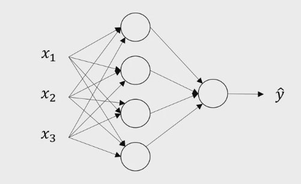
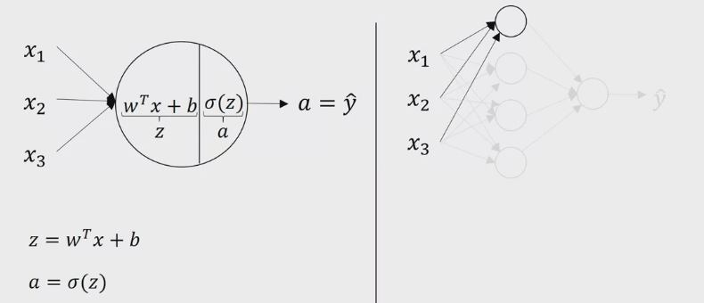
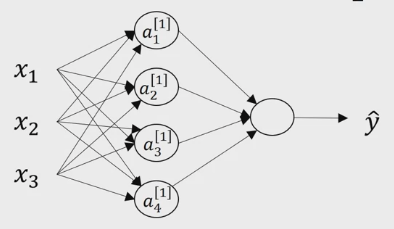
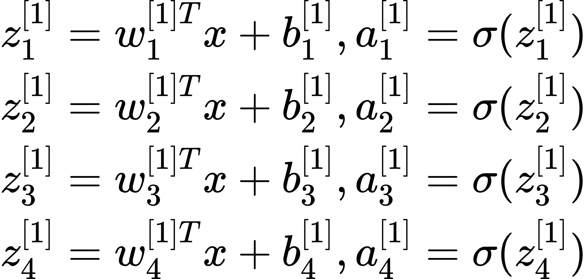
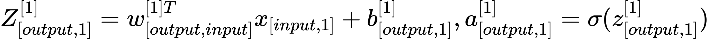
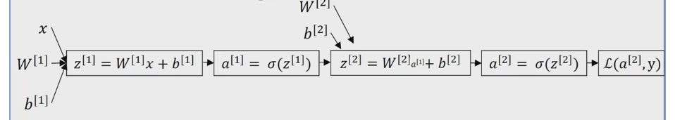
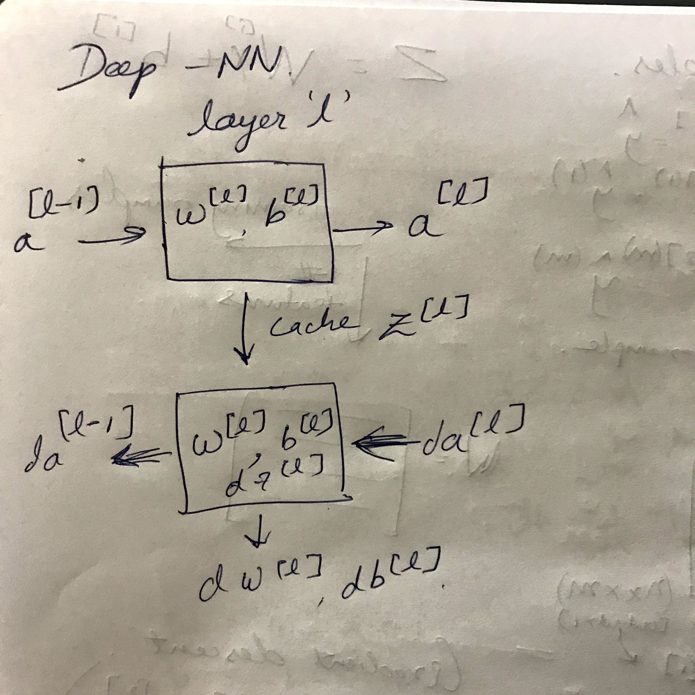

# Neural Network
## Shallow Neural Network Explained

2-layer network is shown above. The input layer is not counted in notation.

Each node is form of logistic regression.

We introduced a new notation of square brackets to denote layer number with subscript of id's of hidden units.

<!-- $
\begin{split}
z^{[1]}_{1} &= w^{[1]T}_{1}x + b^{[1]}_{1}, a^{[1]}_{1} = \sigma(z^{[1]}_{1})\\
z^{[1]}_{2} &= w^{[1]T}_{2}x + b^{[1]}_{2}, a^{[1]}_{2} = \sigma(z^{[1]}_{2})\\
z^{[1]}_{3} &= w^{[1]T}_{3}x + b^{[1]}_{3}, a^{[1]}_{3} = \sigma(z^{[1]}_{3})\\
z^{[1]}_{4} &= w^{[1]T}_{4}x + b^{[1]}_{4}, a^{[1]}_{4} = \sigma(z^{[1]}_{4})\\
\end{split}
$ --> 

<!-- $
Z^{[1]}_{[output,1]} = w^{[1]T}_{[output,input]}x_{[input,1]} + b^{[1]}_{[output,1]}, a^{[1]}_{[output,1]} = \sigma(z^{[1]}_{[output,1]})\\
$ --> 

Finally we have above representation of NN.
$
\begin{split}
z^{[1]} &= W^{[1]}x + b^{[1]}\\
a^{[1]} &= \sigma(z^{[1]})\\
z^{[2]} &= W^{[2]}a^{[1]} + b^{[2]}\\
a^{[2]} &= \sigma(z^{[2]})\\
\end{split}
$

### Vectorized over m examples

$
\begin{split}
Forward-pass:\\
for( i = 1 ->  m)\\
z^{[1](i)} &= W^{[1]}x + b^{[1]}\\
a^{[1](i)} &= \sigma(z^{[1](i)})\\
z^{[2](i)} &= W^{[2]}a^{[1](i)} + b^{[2]}\\
a^{[2](i)} &= \sigma(z^{[2](i)})\\
\end{split}
$

$
\begin{split}
X &= \begin{bmatrix}
| & | & |\\
X^{1} & X^{2} &... X^{m}\\
| & | & |\\
\end{bmatrix}\\
\\
X&:\big[n^{x},m\big]\\
n^{x}&:features\\
m&:examples\\
\end{split}
$

$
\begin{split}
Z^{[1]} &= \begin{bmatrix}
| & | & |\\
z^{[1](1)} & z^{[1](2)} &... z^{[1](m)}\\
| & | & |\\
\end{bmatrix}\\
\\
Z^{[1]}&:\big[n^{x},m\big]\\
n^{x}&:features\\
m&:examples\\
\end{split}
$

$
\begin{split}
A^{[1]} &= \begin{bmatrix}
| & | & |\\
a^{[1](1)} & a^{[1](2)} &... a^{[1](m)}\\
| & | & |\\
\end{bmatrix}\\
\\
A^{[1]}&:\big[n^{x},m\big]\\
n^{x}&:features\\
m&:examples\\
\end{split}
$

$
\begin{split}
Z^{[1]} &= W^{[1]}x + b^{[1]}\\
A^{[1]} &= g^{[1]}(z^{[1]})\\
Z^{[2]} &= W^{[2]}a^{[1]} + b^{[2]}\\
A^{[2]} &= g^{[2]}(z^{[2]})\\
\end{split}
$

$
\begin{split}
Backward - pass:\\
dZ^{[2]} &= A^{[2]} - Y\\
dW^{[2]} &= \dfrac{1}{m}dZ^{[2]}A^{[1]T}\\
db^{[2]}&=\dfrac{1}{m}np.sum(dZ^{[2]}, axis=1, keepdims=True)\\
\\
dZ^{[1]} &= W^{[2]}dZ^{[1]} * g^{[1]'}(Z^{[1]}) \\
dW^{[1]} &= \dfrac{1}{m}dZ^{[1]}X^{T}\\
db^{[1]} &=\dfrac{1}{m}np.sum(dZ^{[1]}, axis=1, keepdims=True)\\
\\
Update:\\
W^{[1]}&=W^{[1]} - \alpha . dW^{[1]}\\
b^{[1]}&=b^{[1]} - \alpha . db^{[1]}\\
\end{split}
$

## Deep Neural Network Explained

Vectorized Implementation for a deep layer network:

$
\begin{split}
Matrix-check\\
l &: layer\\
m &: examples\\
Z^{[l]}_{[output,m]} &= W^{[l]T}_{[output,input]}X_{[input,m]} + b^{[l]}_{[output,m]}\\
\end{split}
$

$
\begin{split}
\\
Forward&:\\
Layer&:l\\
Input&:a^{[l-1]}\\
Output&:a^{[l]}, Cache(z^{[l]})\\
\\
Z^{[l]}_{[output,m]} &= W^{[l]T}_{[output,input]}A_{[input,m]} + b^{[l]}_{[output,m]}\\
A^{[l]}_{[output,m]} &= g^{[l]}(Z^{[l]}_{[output,m]})\\
\end{split}
$

$
\begin{split}
\\
Backward&:\\
Layer&:l\\
Input&:da^{[l]}\\
Output&:da^{[l-1]}, dW^{[l]}, db^{[l]},\\
\\
dZ^{[l]}_{[output,m]} &= dA^{[l]} * g^{[l]'}(Z^{[l]}_{[output,m]})\\
dW^{[l]}&=\dfrac{1}{m}dZ^{[l]}A^{[l-1]T}\\
db^{[l]}&=\dfrac{1}{m}np.sum(dZ^{[l]}, axis=1, keepdims=True)\\
dA^{[l-1]}&=W^{[l]T}dZ^{[l]}\\
\\
\end{split}
$